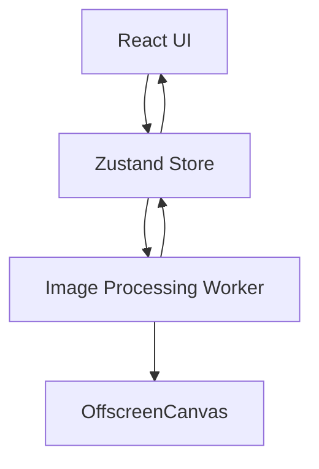

# ConvertImages

**ConvertImages** es una aplicación web moderna para convertir y procesar imágenes directamente en el navegador. A diferencia de las plataformas tradicionales que requieren subir archivos a servidores externos, ConvertImages ejecuta todo el procesamiento localmente utilizando tecnologías nativas del navegador como **Web Workers** y **OffscreenCanvas**.

Este enfoque elimina preocupaciones de privacidad, reduce tiempos de espera y permite procesar imágenes sin depender de infraestructura de servidor.

## ¿Por qué ConvertImages?

Los convertidores de imágenes tradicionales suelen depender de servicios remotos para procesar archivos. Esto implica:

* Transferencia de datos a servidores de terceros.
* Riesgos de privacidad.
* Costos operativos elevados.
* Límites de uso, tamaño o cantidad de archivos.

ConvertImages adopta una filosofía diferente:

* Procesamiento 100% local.
* Sin registros ni cuentas.
* Sin anuncios.
* Sin límites artificiales.
* Código abierto y auditable.

## Características

### Privacidad por Diseño

Todas las imágenes permanecen en el dispositivo del usuario. Ningún archivo es enviado a servidores externos.

### Procesamiento de Alto Rendimiento

Las tareas pesadas se ejecutan mediante Web Workers, permitiendo que la interfaz permanezca fluida incluso durante conversiones por lotes.

### Conversión Instantánea

Conversión rápida entre formatos populares:

* PNG
* JPEG
* WebP

### Procesamiento por Lotes

Convierte múltiples imágenes simultáneamente sin bloquear la interfaz.

### Sin Dependencias de Backend

La aplicación funciona completamente del lado del cliente, eliminando costos de infraestructura y simplificando el despliegue.

### Código Abierto

Toda la lógica de procesamiento es transparente y puede ser auditada, modificada y mejorada por la comunidad.

---

## Tecnologías

| Categoría     | Tecnología      |
| ------------- | --------------- |
| Framework     | React 19        |
| Lenguaje      | TypeScript      |
| Estado Global | Zustand         |
| Estilos       | Tailwind CSS 4  |
| Animaciones   | Framer Motion   |
| Bundler       | Vite            |
| Procesamiento | Web Workers     |
| Renderizado   | OffscreenCanvas |

---

## Modos de Trabajo

### Convertir

Diseñado para conversiones rápidas y procesamiento por lotes.

Ejemplos:

* PNG → WebP
* JPEG → PNG
* WebP → JPEG

### Editar

Herramientas enfocadas en modificaciones individuales:

* Recorte
* Redimensionamiento
* Rotación
* Ajustes adicionales

### Inicio

Pantalla principal desde la que el usuario selecciona el flujo de trabajo deseado.

---

## Instalación

### Requisitos

* Node.js 22+
* pnpm 10+

### Clonar el repositorio

```bash
git clone https://github.com/usuario/convert-images.git
cd convert-images
```

### Instalar dependencias

```bash
pnpm install
```

### Entorno de desarrollo

```bash
pnpm dev
```

### Generar build de producción

```bash
pnpm build
```

### Vista previa local

```bash
pnpm preview
```

---

## Estructura del Proyecto

```text
convert-images/
├── src/
│   ├── components/
│   │   ├── HomeSelector.tsx
│   │   ├── ImageDropzone.tsx
│   │   ├── QueueManager.tsx
│   │   ├── TabNavigation.tsx
│   │   └── SidebarSettings.tsx
│   │
│   ├── stores/
│   │   └── imageStore.ts
│   │
│   ├── workers/
│   │   └── image-processor.worker.ts
│   │
│   └── App.tsx
│
├── public/
├── package.json
├── vite.config.ts
└── README.md
```

---

## Arquitectura

La aplicación utiliza una arquitectura basada en una tienda centralizada que coordina la interfaz y los procesos de fondo.



### Flujo de procesamiento

1. El usuario selecciona una o varias imágenes.
2. Los archivos se registran en la cola global.
3. La tarea se envía al Web Worker.
4. El Worker procesa la imagen usando OffscreenCanvas.
5. El resultado vuelve al estado global.
6. La interfaz actualiza el progreso y permite descargar los archivos generados.

---

## Filosofía del Proyecto

ConvertImages se construye bajo cuatro principios fundamentales:

### Privacidad

Los datos pertenecen al usuario.

### Rendimiento

El hardware del cliente debe aprovecharse al máximo.

### Simplicidad

La experiencia debe ser rápida e intuitiva.

### Accesibilidad

Las funciones principales deben estar disponibles sin barreras ni suscripciones.

---

## Hoja de Ruta

Funciones previstas para futuras versiones:

* Soporte AVIF
* Soporte JPEG XL
* Compresión avanzada
* Eliminación de metadatos EXIF
* Optimización inteligente de tamaño
* Procesamiento masivo de carpetas
* Progressive Web App (PWA)
* Arrastrar y soltar desde carpetas
* Comparación antes/después
* Historial local de conversiones

---

## Contribuciones

Las contribuciones son bienvenidas.

```bash
# Crear una rama
git checkout -b feature/nueva-funcionalidad

# Realizar cambios
git commit -m "Añadir nueva funcionalidad"

# Publicar rama
git push origin feature/nueva-funcionalidad
```

Posteriormente abre un Pull Request describiendo los cambios realizados.

---

## Licencia

Este proyecto se distribuye bajo la licencia especificada en el repositorio.
